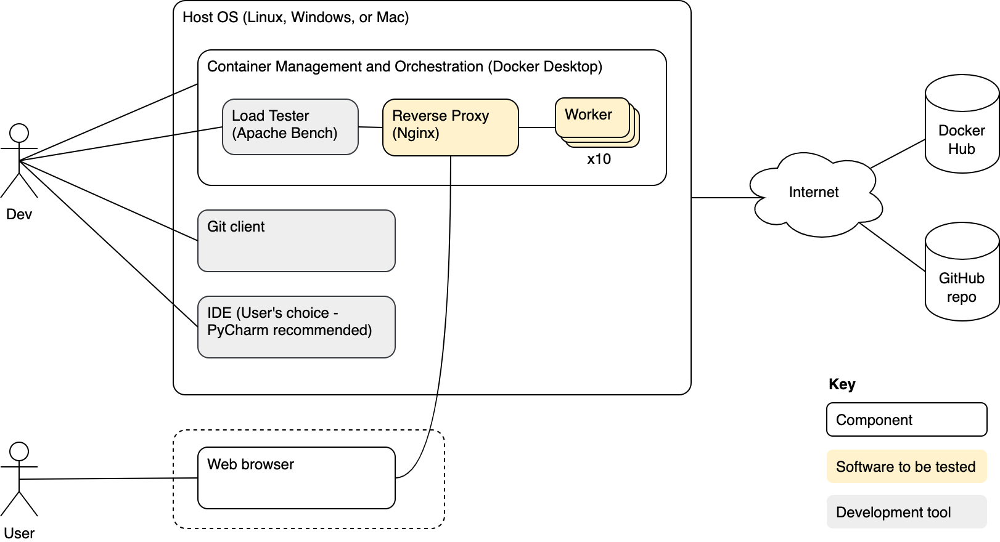
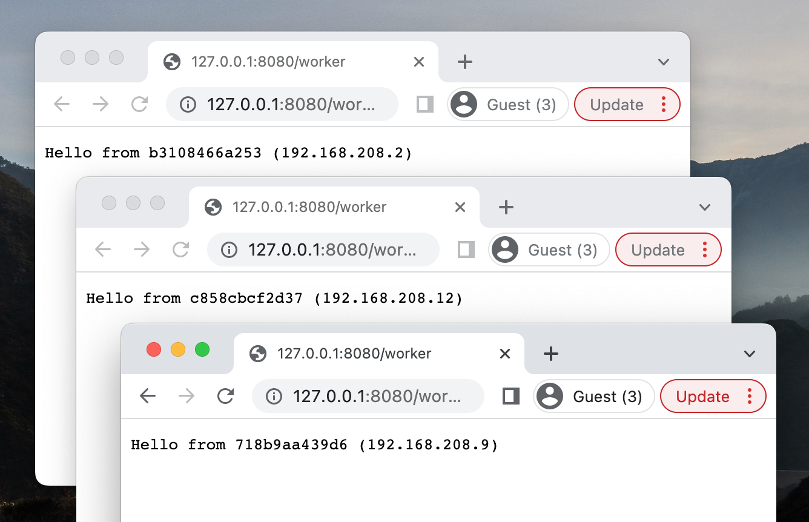

[](https://github.com/bunchofstring/dcs/actions/workflows/python-app.yml)
# Docker Compose Sandbox (DCS)
An attempt to build knowledge about containerization, Python, and GitHub Actions. This repo began as a series of mostly unrelated experiments. Eventually, they coalesced into a simple concept.

Below are some features of DCS
1. Service provides a greeting from a "worker"
1. Workers are protected by an intermediary
1. Tests help keep workers healthy

Below is a high-level diagram of the software in this repo and some tools that support its ongoing development. Note that for maintenance purposes the editable diagram is embedded in the image file at [doc/resources/sandbox_overview.drawio.png](doc/resources/sandbox_overview.drawio.png). To update the diagram, use the web-based WYSIWYG editor at https://diagrams.net/ to arrange boxes, lines, etc.

<br>


# Get Started
The following is a guide to get DCS up and running. It also describes how to test the software.

| Step                                          | Notes                                                                                                                                                                                                                                                   |
|:----------------------------------------------|:--------------------------------------------------------------------------------------------------------------------------------------------------------------------------------------------------------------------------------------------------------|
| 1.&nbsp;Clone&nbsp;this&nbsp;repo             | Open a shell and enter the following command<br>`git clone https://github.com/bunchofstring/dcs.git`<br><br>Guide:&nbsp;https://docs.github.com/en/repositories/creating-and-managing-repositories/cloning-a-repository                                 |
| 2.&nbsp;Install&nbsp;Docker                   | Recommendation is to install Docker Desktop version 4.12.0 or greater (which includes Docker 20.10.17 or greater). Ref: https://docs.docker.com/get-docker/                                                                                             |
| 3.&nbsp;Run&nbsp;DCS&nbsp;containers          | Open a shell and navigate to the repo that was cloned in step 1. Enter the following command<br>`docker compose up -d`                                                                                                                                  |
| 4.&nbsp;Observe&nbsp;DCS&nbsp;in&nbsp;action! | Open a web browser and navigate to http://127.0.0.1:8080/worker. The page is generated by the services started in the previous step. Refresh the page and notice that the text changes every time.<br>    |
| 5.&nbsp;(Optional)&nbsp;Install&nbsp;Python   | Version 3.10 or greater. This step is required to run the Python-based worker or its tests outside of a container. Ref: https://www.python.org/downloads/                                                                                               |

# Test It!
In addition to the informal manual testing that takes place in development, some tests were automated and they are part of this repo.

## Automated test proportions
Compare the number of tests for each type (system, integration, and unit). These are categorized in the code using markers of the same name ([an example](https://github.com/bunchofstring/dcs/blob/c6a24bd06a41855a336edbd6e96b99c2296bf35c/worker/source/test_sandbox.py#L30)).
```shell
pytest -m system --collect-only | grep "tests collected" && pytest -m integration --collect-only | grep "tests collected" && pytest -m unit --collect-only | grep "tests collected"
```
Sample output from the command above. The first number on each line indicates the number of tests of that type. Types are system, integration, and unit - in that order.
```shell
================= 4/9 tests collected (5 deselected) in 0.03s ==================
================= 2/9 tests collected (7 deselected) in 0.03s ==================
================= 3/9 tests collected (6 deselected) in 0.03s ==================
```

Notice that the proportion of different test types does not match the classic "test pyramid" shape. However, this is only a guideline (ref: https://martinfowler.com/articles/2021-test-shapes.html).

## Expected behavior
Staged testing helps facilitate fast feedback on new code changes. The commands below will find and execute tests with the associated marker.
```shell
pytest -vv --durations=0 -s -m unit
pytest -vv --durations=0 -s -m integration
pytest -vv --durations=0 -s -m system
```
Note: The test categories above are intentionally ordered from fastest to slowest and from most tests to fewest tests. There are other ways to index the tests (e.g. smoke, sanity, etc.) but the organizational scheme was chosen to highlight the nature of each test.
## Acceptable performance
Apache Bench can generate significant load on the system and provides human-readable results. Thanks to a kind Internet stranger named Jordi (https://github.com/jig/docker-ab), it is conveniently packaged and available on Docker Hub. To give it a try, execute the command below.
```shell
# 10,000 requests within 30 seconds
docker run --rm jordi/ab -t 30 -n 10000 -c 5000 -l http://host.docker.internal:8080/worker/
```
<details>
  <summary>Output from the above command</summary>
   
The following is from a MacBook Pro, 2015 model
```shell
Benchmarking host.docker.internal (be patient)
Completed 1000 requests
Completed 2000 requests
Completed 3000 requests
Completed 4000 requests
Completed 5000 requests
Completed 6000 requests
Completed 7000 requests
Completed 8000 requests
Completed 9000 requests
Completed 10000 requests
Finished 10000 requests


Server Software:        nginx/1.23.1
Server Hostname:        host.docker.internal
Server Port:            8080

Document Path:          /worker/
Document Length:        Variable

Concurrency Level:      5000
Time taken for tests:   23.331 seconds
Complete requests:      10000
Failed requests:        0
Total transferred:      1361999 bytes
HTML transferred:       391999 bytes
Requests per second:    428.61 [#/sec] (mean)
Time per request:       11665.651 [ms] (mean)
Time per request:       2.333 [ms] (mean, across all concurrent requests)
Transfer rate:          57.01 [Kbytes/sec] received

Connection Times (ms)
              min  mean[+/-sd] median   max
Connect:        1  918 1331.2    454    7704
Processing:   117 1407 2200.5    568   23022
Waiting:        5 1383 2201.4    542   23021
Total:        286 2324 2589.7   1161   23272

Percentage of the requests served within a certain time (ms)
  50%   1161
  66%   1983
  75%   2402
  80%   2966
  90%   5277
  95%   8056
  98%  10505
  99%  13349
 100%  23272 (longest request)
```
</details>

# Lessons Learned

## Docker and Docker Compose
A small collection of useful docker commands.
1. Disconnect all containers from the default network
   ```shell
   for i in ` docker network inspect -f '{{range .Containers}}{{.Name}} {{end}}' dcs_default`; do docker network disconnect -f dcs_default $i; done;
   ```
1. Stop all containers
   ```shell
   docker stop $(docker container list -q)
   ```
1. Live stats about resource usage
   ```shell
   docker stats
   ```
1. Clean up "orphans"
   ```shell
   docker compose down --remove-orphans
   ```
1. Stop, rebuild, then start the containers
   ```shell
   docker compose down && docker compose build && docker compose up -d
   ```
